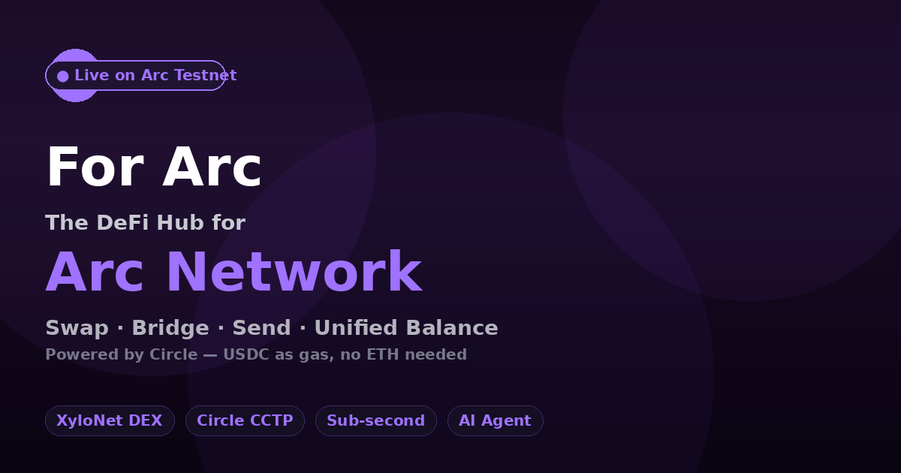

# For Arc — DeFi Hub for Arc Network

> Swap, bridge, send, and unify USDC across chains. Built on Arc Network — Circle's stablecoin-native L1. Pay gas in USDC, no ETH needed.

🔗 **Live**: [for-arc.vercel.app](https://for-arc.vercel.app)



## Features

| Feature | Description | Tech |
|---------|-------------|------|
| **Swap** | Real on-chain token swaps (USDC ↔ EURC) via XyloNet DEX | Arc RPC, Viem, Wagmi |
| **Bridge** | Cross-chain USDC bridging from Ethereum, Base, or Arbitrum to Arc | Circle CCTP v2 |
| **Send** | Instant wallet-to-wallet transfers on Arc | Arc RPC, sub-second finality |
| **Unified Balance** | Deposit USDC from any chain into Circle Gateway — one balance, instant transfers | Circle AppKit |
| **AI Agent** | Natural language → onchain intent parsing ("swap 10 USDC to EURC") | Mistral AI |
| **Live Stats** | Real-time block number, gas price, token count from Arc testnet | Arc RPC, ArcScan API |

## Why Arc?

Arc Network is a stablecoin-native L1 by Circle where **USDC is gas** — no ETH needed. Transactions confirm in under 1 second.

- **USDC as Gas**: Pay all fees in the stablecoin you already hold
- **Sub-second Finality**: Transactions confirm in <1 second
- **Circle Infrastructure**: Built on audited, battle-tested infrastructure
- **Cross-chain**: Bridge USDC from Ethereum, Base, or Arbitrum via CCTP

## Tech Stack

- **Framework**: Next.js 16 (App Router)
- **Styling**: Tailwind CSS v4
- **Animation**: Framer Motion
- **Web3**: Viem + Wagmi + Privy (auth)
- **Chain**: Arc Network (testnet)
- **Bridge**: Circle CCTP v2 + Circle AppKit
- **DEX**: XyloNet (Arc-native)
- **AI**: Mistral AI (intent parsing)
- **Deploy**: Vercel

## Getting Started

```bash
# Install
npm install

# Set environment variables
cp .env.example .env.local
# Add your MISTRAL_API_KEY, NEXT_PUBLIC_KIT_KEY, NEXT_PUBLIC_PRIVY_APP_ID

# Develop
npm run dev

# Build
npm run build
```

## Environment Variables

| Variable | Description |
|----------|-------------|
| `MISTRAL_API_KEY` | Mistral AI API key for the agent intent parser |
| `NEXT_PUBLIC_KIT_KEY` | Circle AppKit client key |
| `NEXT_PUBLIC_PRIVY_APP_ID` | Privy app ID for wallet auth |

## Architecture

```
app/
├── page.tsx              # Landing page with live stats + features
├── swap/                 # XyloNet DEX swap interface
├── bridge/               # Circle CCTP cross-chain bridge
├── send/                 # Wallet-to-wallet transfers
├── unified-balance/      # Circle Gateway unified balance
├── agent/                # AI-powered transaction agent
└── api/
    ├── agent/            # Mistral AI intent parser
    └── gateway-balance/  # Circle AppKit balance proxy

components/
├── SwapCard.tsx          # DEX swap with live quotes
├── BridgeCard.tsx        # CCTP bridge form
├── SendCard.tsx          # Transfer form
├── UnifiedBalanceCard.tsx# Gateway balance display
├── AgentChat.tsx         # AI agent chat interface
├── AnimatedBg.tsx        # Mesh gradient background
├── Tilt3DCard.tsx        # 3D tilt card component
├── Header.tsx / Footer.tsx
└── ...
```

## Built for the Arc Community

This project is built for the [Arc Architects program](https://community.arc.io/home/clubs/architects/overview) — a community of builders contributing to the Arc ecosystem.

## License

MIT
